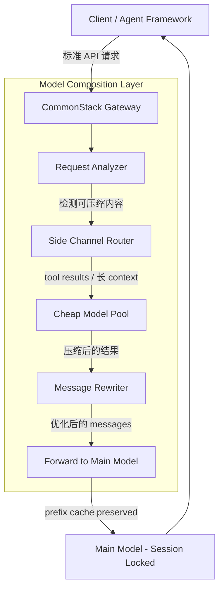
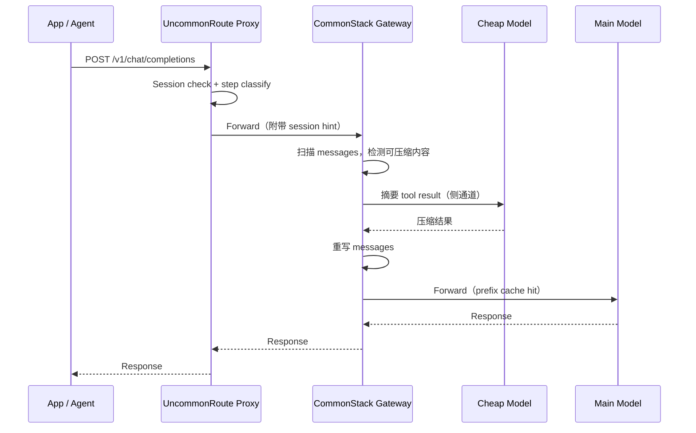

# Model Composition: Agent Loop 场景下的 LLM 成本优化架构

## 1. 问题：Per-Request Routing 在 Agent Loop 中失效

UncommonRoute 当前对每个 `/v1/chat/completions` 请求独立做 routing：提取最后一条 user message → classifier 打分 → 选模型 → forward。这个架构在无状态单轮请求中表现良好，但在 agent loop（Cursor、Devin、LangChain 等）场景下有三个根本问题。

### 1.1 Router 是 Context-Blind 的

Agent framework 每轮 API call 发送完整 `messages` 数组，但 router 只看最后一条 user message。

```
Turn 1:  user("构建分布式系统")      → classifier 看到完整意图 → REASONING ✓
Turn 5:  user("continue")            → classifier 只看这一条 → SIMPLE ✗
Turn 12: user("fix the type error")  → SIMPLE ✗（实际需要理解 50K context）
```

Session-sticky 机制恰好掩盖了这个问题——但这是偶然，不是设计。

### 1.2 换模型会摧毁 Prefix Cache

主流 provider 都支持 prefix caching（Anthropic 0.1x, OpenAI 0.5x, DeepSeek 大幅折扣）。Agent loop 中 context 线性增长，cache 的杠杆随 turn 数放大：

```
Turn 1:  2K tokens   → 全量 prefill
Turn 5:  30K tokens  → 25K cached (0.1x), 5K 新算
Turn 20: 100K tokens → 95K cached (0.1x), 5K 新算
```

**一次模型切换 = 所有 cache 失效 = 100K tokens 全价 prefill。**

### 1.3 Input Tokens 才是成本大头

在 agent loop 中，每轮的 output 通常是几百到几千 tokens，但 input（累积 context）是几万到十几万 tokens。**Input 是 output 的 10-50 倍。** 因此：

- Per-request routing 试图省的是 **output token 的模型差价**（小钱）
- 实际该省的是 **input token 的总量和单价**（大钱）

这引出一个根本性的重新定义：

> **问题不是 "该用哪个模型"，而是 "如何减少主模型需要处理的 input"。**

---

## 2. Model Composition：核心思路

### 2.1 从 Model Switching 到 Model Composition

传统 routing 的思路是 **model switching**：根据请求复杂度，在不同模型之间切换。这隐含一个假设——便宜模型**替代**贵模型处理某些请求。

Model composition 的思路完全不同：**主模型不换，便宜模型作为侧通道做预处理/后处理。**

```
Model Switching (传统):      A → B → A → B    （每次切换 = cache miss）
Model Composition (新):      A → A → A → A    （主流程不断）
                              ↕   ↕   ↕        （侧通道 B 做辅助）
```

两者的本质区别：

| | Model Switching | Model Composition |
|---|---|---|
| 便宜模型的角色 | **替代**主模型 | **辅助**主模型 |
| 主模型 context | 每次切换都断 | 始终连续 |
| Prefix cache | 频繁失效 | 保持 |
| 省钱杠杆 | output token 差价 | input token 压缩 |
| 对推理连贯性的影响 | 有风险（换脑子） | 无（主模型不变） |

### 2.2 架构总览



核心流程：

1. 请求进入 gateway
2. **Request Analyzer** 扫描 `messages` 数组，识别可压缩的内容（大体积 tool result、冗长的历史 turn）
3. **Side Channel Router** 将这些内容发给便宜模型做压缩/摘要
4. **Message Rewriter** 用压缩结果替换原始内容，构建优化后的 `messages`
5. 优化后的请求 forward 给主模型——prefix 不变，cache hit，context 更短

---

## 3. 三个核心操作

### 3.1 Tool Result 压缩

**场景**：Agent 调用 tool（搜索文档、读文件、执行代码），tool 返回大量原始数据。

**问题**：Tool result 动辄几千 tokens（一个文件内容、一页搜索结果），但主模型真正需要的信息可能只有几百 tokens。这些 raw data 不断累积在 messages 里，每轮都要重新处理。

**做法**：Gateway 检测到 `role: tool` 的 message content 超过阈值（如 2000 tokens），自动 fork 一个 cheap model call 做摘要，用摘要替换原始内容后再 forward。

```
原始 messages:
  [sys] [user] [asst+tool_call] [tool: 5000 tokens of raw file content]

压缩后:
  [sys] [user] [asst+tool_call] [tool: 200 tokens summary of key points]
```

**对 prefix cache 的影响**：

- `[sys] [user] [asst+tool_call]` 这段 prefix **完全不变** → cache hit
- `[tool: ...]` 是新内容，无论压缩与否都需要 prefill，但压缩后只需 prefill 200 tokens 而非 5000 tokens
- **结论：Tool result 压缩只有收益，没有 cache 代价**

**收益**：

- 主模型 input tokens 减少（直接省钱）
- Context window 消耗减慢（session 可以持续更多 turn）
- 主模型处理更精炼的信息，可能提高推理质量

### 3.2 Historical Turn Summarization

**场景**：Agent loop 跑了 20+ 轮，context 逼近模型的 window limit。

**问题**：早期 turn 的细节对当前推理可能已经不重要，但它们占据了大量 context space，而且每轮都要重新处理。

**做法**：当总 token 超过阈值（如 context window 的 70%），用便宜模型对早期 turn 做 summarization。

```
原始: [sys] [u1] [a1] [u2] [a2] ... [u10] [a10] [u11]
                                      ↑ 保留最近 N 轮
压缩: [sys] [summary: turns 1-8 的关键决策和上下文] [u9] [a9] [u10] [a10] [u11]
```

**对 prefix cache 的影响**：

- **会破坏 cache**。`[sys]` 之后的内容变了，prefix 不再匹配。
- 因此这是一个 **兜底策略**，只在接近 window limit 时触发，不作为常规优化。

**收益**：

- 防止 context overflow 导致的 session 中断
- 用一次 cache miss 的代价换取 session 可以继续（否则整个 session 就断了）

### 3.3 Structured Extraction

**场景**：Agent 需要从主模型的 response 中提取结构化数据（JSON、参数、关键字段），或者需要对 response 做格式转换。

**问题**：如果让主模型自己做（"请把上面的结果整理成 JSON"），等于用贵模型做简单的格式化工作，浪费。

**做法**：主模型只负责推理和生成，后处理（extraction、formatting）交给便宜模型在侧通道完成。

```
主模型 response: "根据分析，你应该用 PostgreSQL 做主存储，Redis 做缓存，
                  partition key 用 user_id，保留策略 30 天..."

侧通道 (Haiku):
  输入: 主模型 response + "提取为 JSON schema"
  输出: {"primary_db": "postgresql", "cache": "redis", ...}
```

**对 prefix cache 的影响**：无。这是 **post-processing**，不修改主模型的 messages。

---

## 4. 两层部署架构

Model composition 分两层实现：proxy 做轻量决策，gateway 做实际执行。

### 4.1 架构分工



### 4.2 Proxy 层（UncommonRoute）

**定位**：轻量、本地、零额外延迟。

**职责**：

- **Session-level model selection**：首轮 classify，决定主模型 tier，后续锁定
- **Step classification**：识别当前 turn 的类型（tool-result-followup / tool-selection / general）
- **Hint 标注**：在 forward 给 gateway 的请求中附带 session ID、step type 等 metadata，帮助 gateway 做压缩决策
- **简单阈值判断**：如果 tool result < 阈值，跳过压缩（减少不必要的侧通道调用）

Proxy 层 **不做** 实际的压缩调用——它没有直接访问 cheap model 的能力（或者不应该增加这个延迟）。

### 4.3 Gateway 层（CommonStack）

**定位**：服务端，拥有所有 provider 的连接，能做跨 provider 调度。

**职责**：

- **压缩执行**：实际调用 cheap model 做 tool result 摘要、context summarization
- **跨 provider 路由**：主模型走 Anthropic，侧通道走 DeepSeek（成本更低）
- **压缩缓存**：相同 tool + 相同 result → 复用之前的摘要，不重复调用
- **批量处理**：一个请求中有多个大 tool result → 并行发多个侧通道调用
- **质量监控**：跟踪压缩后主模型的输出质量，自适应调节压缩策略

### 4.4 为什么分两层

| 关注点 | Proxy 层 | Gateway 层 |
|---|---|---|
| 延迟敏感度 | 极高（在用户本地） | 可接受额外 100-500ms |
| 可用资源 | 只有本地 CPU | 多 provider、GPU 集群 |
| 全局视野 | 只看单用户流量 | 看所有用户流量 |
| 适合做什么 | 快速决策、标注 | 实际执行、跨 provider 调度 |

Proxy 负责 "要不要压缩" 的判断（快），Gateway 负责 "怎么压缩" 的执行（可能慢但有资源）。

---

## 5. Prefix Cache 保持分析

所有操作的设计原则：**尽可能保持 messages 数组前缀的 byte-identical。**

### 5.1 Prefix Cache 的工作原理

Provider（Anthropic、OpenAI 等）在 GPU 上缓存 token 序列的 KV states。如果新请求的 token 序列与之前请求有相同前缀，前缀部分的 KV states 可以直接复用，跳过 prefill 计算。

关键约束：**前缀必须 byte-identical。** 任何一个 token 的变化都会导致该位置之后的所有 cache 失效。

### 5.2 各操作对 Cache 的影响

```
messages: [sys] [user] [asst] [tool_call] [tool_result] [user2]
           ────── prefix（不动）──────    ──── 新内容 ────
```

| 操作 | 修改位置 | Cache 影响 | 建议 |
|---|---|---|---|
| Tool result 压缩 | messages 末尾的 tool_result | **不破坏 cache** — 之前的 prefix 不变，tool_result 本身是新内容 | 放心做 |
| Historical turn summarization | messages 中间 | **破坏 cache** — prefix 改变 | 仅在逼近 window limit 时触发 |
| Structured extraction | 不修改 messages | **不影响** — 纯后处理 | 放心做 |
| Session-level model hold | 不修改 messages | **保持 cache** — 同模型同 prefix | 默认行为 |

### 5.3 Append-Only 原则

只要遵循 **"只修改末尾、不改中间"** 的原则，prefix cache 就能保持。这对应到 messages 数组：

- **安全**：压缩/替换最后一个 tool_result（它是新追加的内容）
- **安全**：压缩/替换最后几个 message（还没进入下一轮的 prefix）
- **危险**：修改早期 message（已经是 prefix 的一部分）

---

## 6. 成本模型

### 6.1 三个成本控制杠杆

```
┌──────────────────────────────────────────────────────┐
│                  LLM 调用总成本                        │
│                                                      │
│  ┌────────────────────┐  ┌────────────────────────┐  │
│  │    Input Cost       │  │    Output Cost          │  │
│  │                    │  │                        │  │
│  │  ┌──────────────┐  │  │  ┌──────────────────┐  │  │
│  │  │ 杠杆 1:       │  │  │  │ 杠杆 3:           │  │  │
│  │  │ Model Select  │  │  │  │ Output Budget     │  │  │
│  │  │ (session级)   │  │  │  │ (per-turn)        │  │  │
│  │  └──────────────┘  │  │  └──────────────────┘  │  │
│  │  ┌──────────────┐  │  │                        │  │
│  │  │ 杠杆 2:       │  │  │                        │  │
│  │  │ Context       │  │  │                        │  │
│  │  │ Compression   │  │  │                        │  │
│  │  │ (composition) │  │  │                        │  │
│  │  └──────────────┘  │  │                        │  │
│  └────────────────────┘  └────────────────────────┘  │
└──────────────────────────────────────────────────────┘
```

**杠杆 1: Model Selection（session-level routing）**

- 在 session 开始时选对模型 tier
- 简单任务用便宜模型，整个 session 省钱
- 跨 session 维度的优化，impact 最大（70% 的 session 可能是 simple）

**杠杆 2: Context Compression（model composition）**

- 在 session 进行中压缩 input
- 通过 tool result 摘要、历史 turn 压缩减少主模型每轮要处理的 input tokens
- Session 内维度的优化，对长 agent loop 效果显著

**杠杆 3: Output Budget（已有的 R2-Router）**

- 控制每轮 output 的 max_tokens
- 在已选定模型的前提下限制 output 量
- 边际优化，impact 相对小

### 6.2 不同 Workload 的最优策略

| Workload | 杠杆 1 (Model Selection) | 杠杆 2 (Compression) | 杠杆 3 (Output Budget) |
|---|---|---|---|
| 无状态单轮 | **per-request routing** — 无 cache 可言 | 不需要 | 可用 |
| 短 multi-turn (3-5 轮) | **session-level** — 首轮选模型锁定 | 轻量压缩大 tool result | 可用 |
| 长 agent loop (10-50 轮) | **session-level** — 锁定 + escalation | **积极压缩** — tool results + 历史 turns | 可用 |
| 批量处理 | **per-request** — 每条独立 | 不需要 | 可用 |

### 6.3 成本场景对比

**场景：20-turn agent loop，context 增长到 100K tokens，包含 8 个 tool call（每个 tool result ~3000 tokens）**

**策略 A：纯 per-request routing（当前）**

- 假设中途换模型 3 次
- 3 次 cache miss，每次 ~50K tokens 全价 prefill
- 省下的 output 差价：~$0.06
- Cache miss 额外成本：~$0.45
- **净效果：亏 $0.39**

**策略 B：Session-level routing（锁模型，不压缩）**

- Sonnet 全程，prefix cache 持续 hit
- 8 个 tool result × 3000 tokens = 24K tokens 的 raw data 不断在 context 中累积
- 20 turns 累计 input cost：~$0.08（cache hit 0.1x）
- **净效果：比策略 A 省 ~$0.39**

**策略 C：Session-level + Tool Result 压缩**

- Sonnet 全程，prefix cache 持续 hit
- 8 个 tool result 压缩为 ~200 tokens each，节省 8 × 2800 = 22.4K tokens
- 侧通道压缩成本（Haiku）：8 × ~$0.001 = ~$0.008
- Context 更短 → 后续每轮 input 减少 → 累计节省：~$0.03
- **净效果：比策略 B 再省 ~$0.02，且 context window 多出 22K 空间**

策略 C 的直接成本节省看起来不大，但真正的价值在于 **context window headroom**——agent 可以多跑更多 turn 而不撞 window limit，避免 session 中断或被迫做历史 summarization（代价更高的操作）。

---

## 7. 对调用方的透明性

### 7.1 设计原则

Model composition 对调用方 **完全透明**：

- 调用方发标准 OpenAI/Anthropic 格式的 API 请求
- Gateway 内部完成所有压缩和重写
- 调用方收到标准格式的 response
- 调用方不知道（也不需要知道）tool result 被压缩过

### 7.2 可观测性

虽然透明，但调用方应该能够 **观测** composition 的行为：

- Response header 标注：是否触发了压缩、压缩了多少 tokens
- Stats API：压缩率、侧通道调用次数、节省的 token 量
- Debug mode：显示压缩前后的 messages 对比

### 7.3 Opt-out 机制

某些场景下调用方可能不希望 tool result 被压缩（例如 tool result 包含必须精确保留的代码或数据）。应提供：

- Request header `x-composition: none` 跳过所有压缩
- Per-message 标注 `"compress": false` 保护特定 message

---

## 8. 开放问题

### 压缩质量 vs 信息损失

Tool result 被摘要后，主模型可能丢失关键细节。如何平衡压缩率和信息保留？

- 可能需要按 tool 类型采用不同策略（代码文件 vs 搜索结果 vs 日志）
- 需要 A/B 测试：压缩 vs 不压缩对最终任务完成率的影响

### 压缩延迟

侧通道调用增加了请求的端到端延迟。Gateway 需要先等 cheap model 返回压缩结果，再 forward 给主模型。

- 预期增加 100-500ms（cheap model 生成 200 tokens 的时间）
- 对于 agent loop（主模型本身要跑几秒到几十秒）这个延迟可接受
- 对于低延迟场景（chatbot 实时对话）可能不可接受 → 需要阈值控制

### 压缩结果缓存

同一个 tool 在不同 session 中可能返回相同或相似的结果。

- 可以对 tool result 做 hash，缓存压缩结果
- 降低侧通道调用频率，减少延迟和成本

### 质量度量

如何衡量 composition 是否"做对了"？

- 主模型的任务完成率（压缩前 vs 压缩后）
- 主模型是否请求更多信息（间接信号：压缩丢了重要内容）
- 用户反馈信号（现有 feedback 系统可以复用）

---

## 9. 总结

| 策略 | 最佳场景 | 省钱维度 | Prefix Cache | 实现复杂度 |
|---|---|---|---|---|
| Per-request routing | 无状态单轮 | output token 差价 | N/A | 低（已实现） |
| Session-level routing | Multi-turn | 跨 session tier 差异 | 保持 | 低 |
| Model composition | 长 agent loop | input token 压缩 | 保持 | 中 |

**核心观点**：

1. Agent loop 中 **input tokens 是成本大头**，per-request routing 省的是 output 差价（小钱），还会因 cache miss 导致净亏损
2. 正确的成本优化不是 **换模型**，而是 **减少主模型要处理的内容**
3. Model composition 通过 **侧通道 + 主流程不断** 的架构，在不破坏 prefix cache 的前提下压缩 input
4. 两层部署（proxy 做决策，gateway 做执行）利用了 CommonStack 作为 gateway 的天然优势
